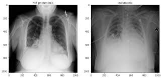

# Pneumonia_Classification
-Classifying a chest x-ray belongs to PNEUMONIA or NORMAL

## Libraries and Api's
- Keras
- MatplotLib
## Dataset
[Chest X-Ray Images (Pneumonia)](https://www.kaggle.com/paultimothymooney/chest-xray-pneumonia)
## Info
- Classifying a chest x-ray weather it has PNEUMONIA or it belongs to a NORMAL person
- Used Xception network and weights that of ImageNet
- Each epoch takes ~60 min to run
- Got Training Accuracy about 98% (For 2 epochs)
- Got Test Accuracy about 75%
